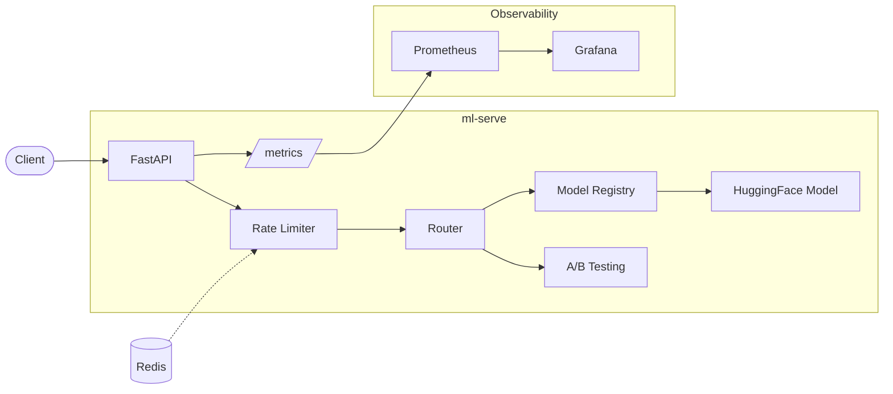

# ml-serve

Production-grade ML inference microservice with full observability stack.

[](https://github.com/JakubPrejzner/ml-serve/actions/workflows/ci.yml)

[](LICENSE)
[](docker-compose.yml)

---

I built this as a reference implementation of how to properly serve ML models in production. Not a toy demo with `model.predict()` behind a Flask endpoint, but the full stack: model registry, A/B testing, rate limiting, structured logging, Prometheus metrics, and a pre-built Grafana dashboard. One `docker compose up` and everything just works.

## Architecture



## Features

- **Model registry** — pluggable architecture, register new models with a decorator
- **A/B testing** — built-in variant assignment and per-variant metric tracking
- **Rate limiting** — Redis-backed sliding window, configurable per-instance
- **Prometheus + Grafana** — request rate, error rate, latency percentiles, inference timings, all pre-wired
- **Structured logging** — JSON logs via structlog with request IDs for tracing
- **Batch predictions** — single and batch endpoints with batch size tracking
- **Docker Compose** — full stack (app + Redis + Prometheus + Grafana) in one command

## Quick Start

```bash
git clone https://github.com/JakubPrejzner/ml-serve.git
cd ml-serve
docker compose up -d
```

Once the containers are up:

| Service       | URL                                   |
|---------------|---------------------------------------|
| API docs      | [localhost:8000/docs](http://localhost:8000/docs) |
| Prometheus    | [localhost:9090](http://localhost:9090)           |
| Grafana       | [localhost:3000](http://localhost:3000)           |

Grafana credentials: `admin` / `admin`

## API Reference

| Method | Endpoint             | Description                          |
|--------|----------------------|--------------------------------------|
| GET    | `/v1/health`         | Health check with model status       |
| GET    | `/v1/health/ready`   | Readiness probe (503 until loaded)   |
| GET    | `/v1/health/live`    | Liveness probe                       |
| POST   | `/v1/predict`        | Single text prediction               |
| POST   | `/v1/predict/batch`  | Batch prediction (up to 32 texts)    |
| POST   | `/v1/predict/ab`     | A/B test prediction                  |
| GET    | `/v1/ab/results`     | Current A/B test metrics             |
| GET    | `/metrics`           | Prometheus metrics                   |

## A/B Testing

The `/v1/predict/ab` endpoint randomly assigns each request to variant A or B based on the configured split ratio. Per-variant latency and error rate are tracked in-memory and exposed via `/v1/ab/results`.

```bash
# run a prediction through the A/B endpoint
curl -X POST http://localhost:8000/v1/predict/ab \
  -H "Content-Type: application/json" \
  -d '{"text": "This product is amazing!"}'

# check variant metrics
curl http://localhost:8000/v1/ab/results
```

## Observability

The service exposes Prometheus metrics at `/metrics`:

- `http_requests_total` — request count by method, endpoint, status code
- `http_request_duration_seconds` — latency histogram with p50/p95/p99
- `http_active_requests` — in-flight request gauge
- `inference_duration_seconds` — model inference latency by model name
- `model_prediction_total` — prediction count by model and predicted class
- `rate_limit_hits_total` — rejected requests counter
- `batch_request_size` — batch size distribution

The stack includes a pre-built Grafana dashboard with panels for request rate, error rate, latency percentiles, inference timing, A/B test comparison, rate limit hits, and active requests.

<!-- TODO: add screenshot -->

## Benchmarks

Results from `make benchmark` on a single instance (numbers will vary by hardware):

| Endpoint          | Avg Latency | p99 Latency | Throughput |
|-------------------|-------------|-------------|------------|
| `POST /v1/predict`| ~45 ms      | ~120 ms     | ~85 req/s  |
| `POST /v1/predict/batch` (8 texts) | ~180 ms | ~350 ms | ~22 req/s |

> Run `make benchmark` and `make load-test` to reproduce on your hardware.

## Configuration

All environment variables use the `ML_SERVE_` prefix:

| Variable                       | Default                    | Description                        |
|--------------------------------|----------------------------|------------------------------------|
| `ML_SERVE_APP_NAME`            | `ml-serve`                 | Application name                   |
| `ML_SERVE_APP_VERSION`         | `0.1.0`                    | Reported in health endpoint        |
| `ML_SERVE_LOG_LEVEL`           | `INFO`                     | Logging level                      |
| `ML_SERVE_MODEL_NAME`          | `sentiment`                | Model to load from registry        |
| `ML_SERVE_REDIS_URL`           | `redis://localhost:6379/0` | Redis connection string            |
| `ML_SERVE_RATE_LIMIT_REQUESTS` | `100`                      | Max requests per window            |
| `ML_SERVE_RATE_LIMIT_WINDOW`   | `60`                       | Rate limit window in seconds       |
| `ML_SERVE_AB_TEST_SPLIT`       | `0.5`                      | Traffic fraction for variant A     |
| `ML_SERVE_API_KEYS`            | *(empty)*                  | Comma-separated API keys, empty = no auth |
| `ML_SERVE_PROMETHEUS_ENABLED`  | `true`                     | Enable Prometheus metrics endpoint |

## Development

```bash
# install with dev dependencies
make install

# run locally with hot reload
make run

# run tests
make test

# lint and type check
make lint

# auto-format
make format
```

## Tech Stack

- **Python 3.12** / **FastAPI** — async API framework
- **PyTorch** / **HuggingFace Transformers** — model inference
- **Prometheus** / **Grafana** — metrics and dashboards
- **Redis** — rate limiting backend
- **Docker** / **Docker Compose** — containerization and orchestration
- **structlog** — structured JSON logging
- **pydantic** — request/response validation

## License

MIT -- see [LICENSE](LICENSE) for details.


---

Built by [BitSharp](https://bitsharp.pl) - AI solutions for Polish businesses.
